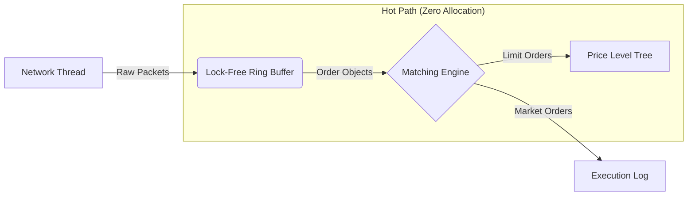

# ⚡ NanoBook: Low-Latency HFT Matching Engine

[](https://shashankbbalagavi20.github.io/NanoBook/)
[](https://opensource.org/licenses/MIT)


> **A high-frequency limit order book (LOB) engine built in C++20, optimized for cache locality and deterministic latency.**

---

## 🚀 Live Documentation
Explore the full architecture, call graphs, and class diagrams on the documentation site:
👉 **[NanoBook Developer Docs](https://shashankbalagavi.github.io/NanoBook/)**

---

## 🧠 Project Overview
NanoBook is a simulation of the core matching logic used in High-Frequency Trading (HFT). It is designed to overcome the latency bottlenecks of standard C++ containers by implementing custom memory management and lock-free concurrency patterns.

### Key Features
* **Custom Slab Allocator:** Uses a pre-allocated `ObjectPool` to manage memory in user-space, avoiding kernel syscalls and memory fragmentation.
* **Lock-Free Architecture:** Decouples the Network (Producer) and Engine (Consumer) using a **Single-Producer Single-Consumer (SPSC)** Ring Buffer.
* **O(1) Order Execution:** Hybrid data structure combining `std::map` (for Price Levels) and `std::unordered_map` (for Order ID lookups).
* **Deterministic Latency:** Zero runtime memory allocation during the critical path (Hot Path).

---

## 📊 Performance Benchmarks
*Validated using Google Benchmark on Apple M-Series Silicon.*

| Allocation Strategy | Time per Op | Speedup |
| :--- | :--- | :--- |
| **Standard `new`/`delete`** | `18.9 ns` | 1x (Baseline) |
| **NanoBook `ObjectPool`** | **`4.6 ns`** | **4.1x Faster** 🚀 |

> **Insight:** By bypassing the OS heap allocator, NanoBook reduces the cost of order creation by **~75%**, bringing execution time down to single-digit nanoseconds.

---

## 🏗️ Architecture

The system follows a classic **Producer-Consumer** pattern to isolate the matching engine from network jitter.


1. Network Thread: Simulates incoming traffic.

2. Ring Buffer: A fixed-size std::vector acting as a circular queue. Uses std::atomic with memory_order_acquire / memory_order_release for thread safety without Mutexes.

3. Matching Engine: The consumer thread that maintains the Order Book state. It owns the memory pool and the book exclusively, eliminating the need for internal locks.

## 🛠️ Build & Run
**Prerequisites**

- CMake (3.15+)

- C++20 Compiler (GCC, Clang, or MSVC)

- Google Test & Google Benchmark (Fetched automatically via CMake)

**1. Build the Project**

```bash
mkdir build && cd build
cmake .. -DCMAKE_BUILD_TYPE=Release
cmake --build .
```

**2. Run the Simulation (TUI Dashboard)**

Visualize the Order Book in real-time.
```bash
./NanoBook
```

**3. Run the Unit Tests**

Verify logic correctness (Matching, Cancellation, Tree Integrity).
```bash
./NanoTests
```

**4. Run the Benchmarks**

Validate the latency numbers on your hardware.
```bash
./NanoBenchmark
```

# 📂 Project Structure
```bash
├── include/LOB/        # Header files (The "Interface")
│   ├── OrderBook.h     # Core engine logic
│   ├── LimitLevel.h    # Price level linked-list
│   ├── ObjectPool.h    # Custom memory allocator
│   └── LockFreeQueue.h # SPSC Ring Buffer
├── src/                # Implementation files
├── tests/              # Google Test suite
├── Doxyfile            # Documentation configuration
└── CMakeLists.txt      # Build configuration
```

# 📜 License
This project is open-source and available under the MIT License.